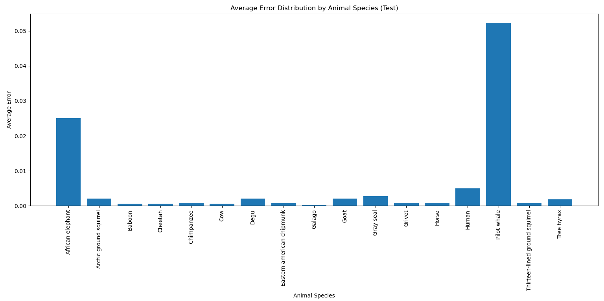

# Error Distribution Analysis by Animal Species

This project analyzes animal sleep patterns and builds a predictive model to estimate `sleep_total` (total sleep time) based on various features. The dataset used for this project is `msleep.csv`, which contains sleep data for different animal species.

## Project Overview

The objective of this project is to explore and model animal sleep patterns using regression analysis. By training a model on various animal characteristics, we aim to predict `sleep_total` for different species and evaluate the model's accuracy. The project includes error analysis and visualization of prediction errors by animal species.

## Dataset

The `msleep.csv` dataset contains sleep-related and physiological characteristics for various animal species. Key features in the dataset include:

- `name`: Animal species name
- `genus`: Genus of the animal
- `vore`: Dietary category (e.g., herbivore, carnivore)
- `order`: Biological order
- `conservation`: Conservation status
- `sleep_total`: Total sleep time (target variable)
- `sleep_rem`: REM sleep time
- `sleep_cycle`: Sleep cycle duration
- `awake`: Total awake time
- `brainwt`: Brain weight
- `bodywt`: Body weight

## Project Workflow

1. **Data Preprocessing**:
   - Missing values in key features are imputed using the mean strategy.
   - The data is split into training and testing sets.

2. **Model Training**:
   - A linear regression model is trained to predict `sleep_total` based on selected features (`sleep_rem`, `sleep_cycle`, `awake`, `brainwt`, `bodywt`).

3. **Prediction and Error Analysis**:
   - Predictions are made on the test set, and errors (difference between actual and predicted `sleep_total`) are calculated.
   - Average prediction error for each animal species is calculated and visualized.

4. **Visualization**:
   - A bar plot visualizes the average prediction error for each animal species in the test set, highlighting the model's performance across different species.

### Error Distribution (Test)

---
## Code

The code includes the following steps:

- Import libraries and load data
- Handle missing values with mean imputation
- Split data into training and testing sets
- Train a linear regression model
- Predict sleep totals for test data
- Calculate error for each species and plot the average error

## Usage

1. Ensure `msleep.csv` is in the same directory as the code file.
2. Run the Python script to load data, train the model, and visualize prediction errors.

```bash
python main.py
